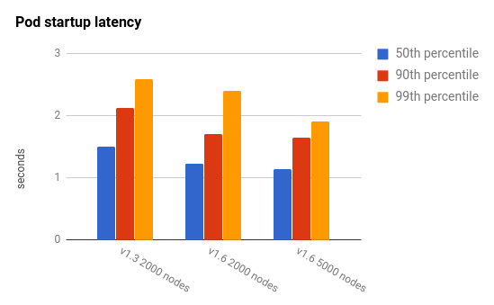
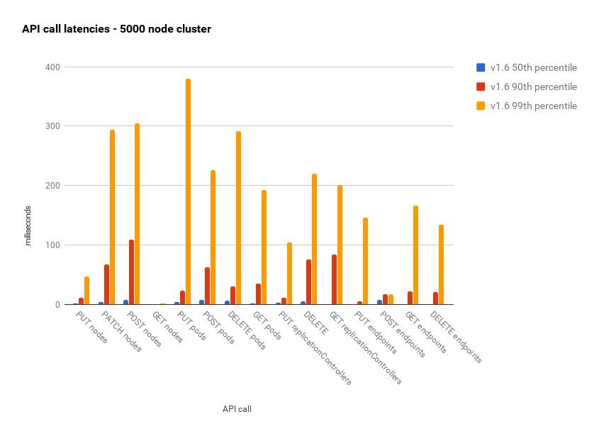

Thursday, March 30, 2017
Scalability updates in Kubernetes 1.6: 5,000 node and 150,000 pod clusters
Editor’s note: this post is part of a series of in-depth articles on what's new in Kubernetes 1.6

Last summer we shared updates on Kubernetes scalability, since then we’ve been working hard and are proud to announce that Kubernetes 1.6 can handle 5,000-node clusters with up to 150,000 pods. Moreover, those cluster have even better end-to-end pod startup time than the previous 2,000-node clusters in the 1.3 release; and latency of the API calls are within the one-second SLO.

In this blog post we review what metrics we monitor in our tests and describe our performance results from Kubernetes 1.6. We also discuss what changes we made to achieve the improvements, and our plans for upcoming releases in the area of system scalability.

X-node clusters - what does it mean?

Now that Kubernetes 1.6 is released, it is a good time to review what it means when we say we “support” X-node clusters. As described in detail in a previous blog post, we currently have two performance-related Service Level Objectives (SLO):
API-responsiveness: 99% of all API calls return in less than 1s
Pod startup time: 99% of pods and their containers (with pre-pulled images) start within 5s.
As before, it is possible to run larger deployments than the stated supported 5,000-node cluster (and users have), but performance may be degraded and it may not meet our strict SLO defined above.

We are aware of the limited scope of these SLOs. There are many aspects of the system that they do not exercise. For example, we do not measure how soon a new pod that is part of a service will be reachable through the service IP address after the pod is started. If you are considering using large Kubernetes clusters and have performance requirements not covered by our SLOs, please contact the Kubernetes Scalability SIG so we can help you understand whether Kubernetes is ready to handle your workload now.

The top scalability-related priority for upcoming Kubernetes releases is to enhance our definition of what it means to support X-node clusters by:
refining currently existing SLOs
adding more SLOs (that will cover various areas of Kubernetes, including networking)

Kubernetes 1.6 performance metrics at scale

So how does performance in large clusters look in Kubernetes 1.6? The following graph shows the end-to-end pod startup latency with 2000- and 5000-node clusters. For comparison, we also show the same metric from Kubernetes 1.3, which we published in our previous scalability blog post that described support for 2000-node clusters. As you can see, Kubernetes 1.6 has better pod startup latency with both 2000 and 5000 nodes compared to Kubernetes 1.3 with 2000 nodes [1].

The next graph shows API response latency for a 5000-node Kubernetes 1.6 cluster. The latencies at all percentiles are less than 500ms, and even 90th percentile is less than about 100ms.

How did we get here?

Over the past nine months (since the last scalability blog post), there have been a huge number of performance and scalability related changes in Kubernetes. In this post we will focus on the two biggest ones and will briefly enumerate a few others.

etcd v3
In Kubernetes 1.6 we switched the default storage backend (key-value store where the whole cluster state is stored) from etcd v2 to etcd v3. The initial works towards this transition has been started during the 1.3 release cycle. You might wonder why it took us so long, given that:
the first stable version of etcd supporting the v3 API was announced on June 30, 2016
the new API was designed together with the Kubernetes team to support our needs (from both a feature and scalability perspective)
the integration of etcd v3 with Kubernetes had already mostly been finished when etcd v3 was announced (indeed CoreOS used Kubernetes as a proof-of-concept for the new etcd v3 API)
As it turns out, there were a lot of reasons. We will describe the most important ones below.
Changing storage in a backward incompatible way, as is in the case for the etcd v2 to v3 migration, is a big change, and thus one for which we needed a strong justification. We found this justification in September when we determined that we would not be able to scale to 5000-node clusters if we continued to use etcd v2 (kubernetes/32361 contains some discussion about it). In particular, what didn’t scale was the watch implementation in etcd v2. In a 5000-node cluster, we need to be able to send at least 500 watch events per second to a single watcher, which wasn’t possible in etcd v2.
Once we had the strong incentive to actually update to etcd v3, we started thoroughly testing it. As you might expect, we found some issues. There were some minor bugs in Kubernetes, and in addition we requested a performance improvement in etcd v3’s watch implementation (watch was the main bottleneck in etcd v2 for us). This led to the 3.0.10 etcd patch release.
Once those changes had been made, we were convinced that new Kubernetes clusters would work with etcd v3. But the large challenge of migrating existing clusters remained. For this we needed to automate the migration process, thoroughly test the underlying CoreOS etcd upgrade tool, and figure out a contingency plan for rolling back from v3 to v2.
But finally, we are confident that it should work.

Switching storage data format to protobuf
In the Kubernetes 1.3 release, we enabled protobufs as the data format for Kubernetes components to communicate with the API server (in addition to maintaining support for JSON). This gave us a huge performance improvement.

However, we were still using JSON as a format in which data was stored in etcd, even though technically we were ready to change that. The reason for delaying this migration was related to our plans to migrate to etcd v3. Now you are probably wondering how this change was depending on migration to etcd v3. The reason for it was that with etcd v2 we couldn’t really store data in binary format (to workaround it we were additionally base64-encoding the data), whereas with etcd v3 it just worked. So to simplify the transition to etcd v3 and avoid some non-trivial transformation of data stored in etcd during it, we decided to wait with switching storage data format to protobufs until migration to etcd v3 storage backend is done.

Other optimizations
We made tens of optimizations throughout the Kubernetes codebase during the last three releases, including:
optimizing the scheduler (which resulted in 5-10x higher scheduling throughput)
switching all controllers to a new recommended design using shared informers, which reduced resource consumption of controller-manager - for reference see this document
optimizing individual operations in the API server (conversions, deep-copies, patch)
reducing memory allocation in the API server (which significantly impacts the latency of API calls)
We want to emphasize that the optimization work we have done during the last few releases, and indeed throughout the history of the project, is a joint effort by many different companies and individuals from the whole Kubernetes community.

What’s next?

People frequently ask how far we are going to go in improving Kubernetes scalability. Currently we do not have plans to increase scalability beyond 5000-node clusters (within our SLOs) in the next few releases. If you need clusters larger than 5000 nodes, we recommend to use federation to aggregate multiple Kubernetes clusters.

However, that doesn’t mean we are going to stop working on scalability and performance. As we mentioned at the beginning of this post, our top priority is to refine our two existing SLOs and introduce new ones that will cover more parts of the system, e.g. networking. This effort has already started within the Scalability SIG. We have made significant progress on how we would like to define performance SLOs, and this work should be finished in the coming month.

Join the effort
If you are interested in scalability and performance, please join our community and help us shape Kubernetes. There are many ways to participate, including:
Chat with us in the Kubernetes Slack scalability channel: 
Join our Special Interest Group, SIG-Scalability, which meets every Thursday at 9:00 AM PST
Thanks for the support and contributions! Read more in-depth posts on what's new in Kubernetes 1.6 here.

-- Wojciech Tyczynski, Software Engineer, Google

 [1] We are investigating why 5000-node clusters have better startup time than 2000-node clusters. The current theory is that it is related to running 5000-node experiments using 64-core master and 2000-node experiments using 32-core master. 
