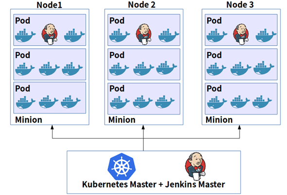
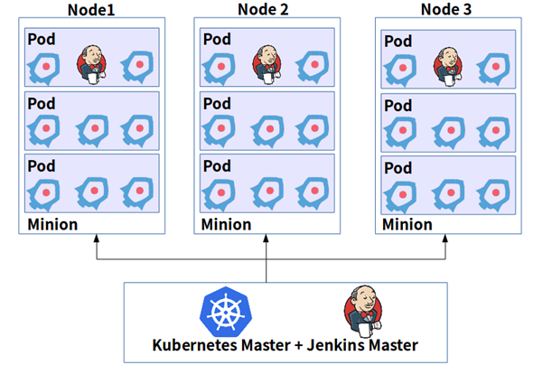
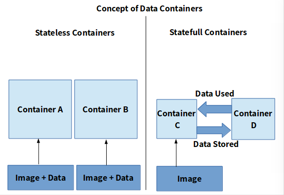
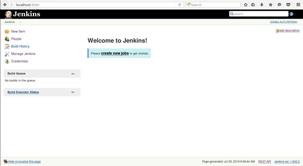

基于Kubernetes的CI/CD
=============================

> Author: [Ramit Surana](https://dzone.com/users/2968218/ramitsurana.html) **DevOps Zone**

> DevOps Zone让你成为Sonatype Nexus的合作伙伴，Nexus套件能帮助你扩展DevOps交付过程，持续的将组件智能的集成到开发工具中，包括：Eclipse, IntelliJ, Jenkins, Bamboo, SonarQube等等，请看[演示](https://www.sonatype.com/nexus-lifecycle?utm_source=DZONE%20-%20Nexus%20Lifecycle%20-%20September%202016&utm_medium=DZONE%20-%20Nexus%20Lifecycle%20-%20September%202016&utm_campaign=DZONE%20-%20Nexus%20Lifecycle%20-%20September%202016)

关于持续集成和持续发布，[Martin Fowler](http://www.martinfowler.com/)给出了最好的定义：

>*“持续集成是一种软件开发实践，团队成员可以频繁的集成他们的工作，通常每个人一天至少一次集成甚至多次集成。每次集成都通过自动化构建和测试进行验证，以尽快检测集成错误。许多团队发现，这种方法可以显著减少集成的问题，并允许团队更加快速的开发。”*

### 简介
-------------

本文将讨论和探索两个令人惊奇和相当有趣的技术。一个是*Jenkins*，一个流行的持续集成/发布的工具，另一个是*Kubernetes*，一个流行的容器编排引擎。另外一个惊喜，我们发现了*Fabric8*——一个酷炫的微服务平台。现在，让我们开始吧！

**警告**:在下文的几个步骤中，你的服务器可能会中途挂起几次，请选择配置高的PC。

### 方法论
-------------

有很多方法，可以让我们实现CI/CD，在本文中，我们重点介绍[Kubneretes-Jenkins插件](http://theremotelab.com/blog/achieving-ci-cd-with-k8s/#kubernetes-jenkins-plugin)和[Fabric8](http://theremotelab.com/blog/achieving-ci-cd-with-k8s/#fabric8)

### 总体架构
-------------

在开始我们的工作之前，让我们花一点时间分析开始使用*Jenkins*使用*Kubernetes*容器所需的工作流。*Kubernetes*对于开发者来说是一个惊人的开源容器编排引擎。*Kubernetes*是由*Google*发起的，这使*Kubernetes*在使用多个开源容器项目方面有一个惊人的优势。默认情况下，Docker更受*Kubernetes*的使用者支持和青睐。使用Docker容器的工作流程如下图所示：



与使用rkt容器(rktnetes)类似，如下图：



目前，Jenkins还没有支持[RKT](http://coreos.com/rkt)容器的插件，但我认为工作流在其实现后也将保持不变。

### Kubernetes-Jenkins 插件
-------------

#### 在你的主机上安装Kubernetes
-------------

在主机上安装*Kubernetes*是一个容易的任务。如果你想在本地机器上试用它，我建议你试试[Minikube](http://github.com/kubernetes/minikube)，这里有[快速安装指南](github.com/kubernetes/minikube)：

1. 确认你的`kubectl`已经安装完成，参考[文档](http://kubernetes.io/docs/getting-started-guides/binary_release/)

2. 确认已经下载完依赖的组件，参考[先决条件](https://github.com/kubernetes/minikube/blob/master/DRIVERS.md)

3. 下载、安装*Minikube*


[Carlossg](https://twitter.com/carlossg)在使用*Jenkins*和*Kubernetes*的方面做了惊人的工作，他为*Jenkins*创建了一个特棒*Kubernetes*插件，使用这个插件，你可以很容易地直接使用*Kubernetes*。此外，还为用户提供了更容易的配置选项，他已经构建了一个包含*Kubernetes*插件的*Jenkins*镜像，镜像可以在*Docker Hub*上找到。在接下来的步骤中，我们将从*Docker Hub*上获取此镜像，并创建一个卷`/var/jenkins/_home`用于存储Jenkins的数据。


#### 存在一个问题
-------------

虽然我们正在做我们计划做的一切，我们仍然会遇到一个问题。 你会注意到，每当你要关闭它后，重新启动你的Jenkins容器，所有的数据都会丢失。 无论你做了什么，例如创建作业，安装插件等等，都会丢失。 这是容器的常见问题之一。 让我们更深入地讨论它。

#### 关于数据容器的一个词
-------------

当谈到容器时，数据是一个棘手的概念。在所有时间保证数据安全、可用性方面容器并不是一个很好的例子。过去发生了许多事件，其中已经看到容器会丢失数据。有很多种办法能解决这个问题，其中之一是使用*Docker*卷，我没有发现使用持久卷的好处。另一个办法是创建“数据容器”，并将其用作存储数据的源，而不是仅仅依赖一个镜像。

下图简单说明了我们使用“数据容器”来确保我们数据可用性的方法：



接下了的步骤是启动*Jenkins Kubernetes*容器：

```bash
//Running jenkins using another container containing data 
$ docker run --volumes-from jenkins-k8s -p 8080:8080 -p 50000:50000 -v /var/jenkins_home csanchez/jenkins-kubernetes 

//Created a container for containing jenkins data with the image name csanchez/jenkins-kubernetes 
$ docker create --name jenkins-k8s csanchez/jenkins-kubernetes 
```

打开浏览器输入`http://localhost:8080`，你会看到如下界面：



### 
