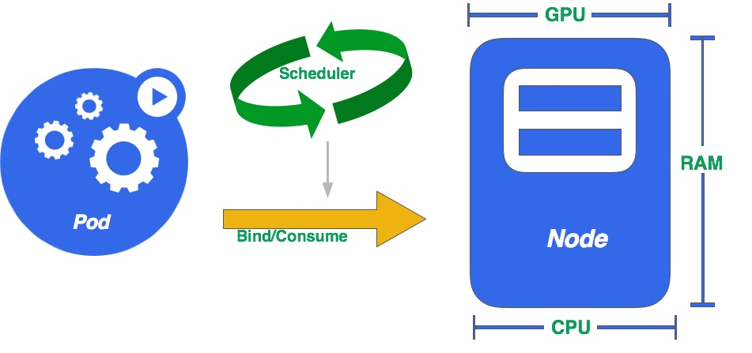

Kubernetes资源模型
===========================

Kubernetes的资源模型的理解对Kubernetes的使用者至关重要，它不仅关系到基础设施和资源的使用率优化，还关系到生产环境中Kubernetes集群的稳定性。

本文我们将一起探讨Kubernetes的资源模型的设计，以及我们如果利用资源模型来提高我们资源的使用率。

### 预热
--------

*在介绍资源模型之前，我们先来简单介绍一下Kubernetes的几个主要概念：*

* Node：计算节点，用来提供计算资源实体，可以理解为物理机、云主机、虚拟机等。

* Pod：Kubernetes调度容器的基本单位，Pod中包含一个或者多个容器，每个Pod最终会被调度到Node上，消费Node上提供的计算资源。

* Scheduler：Kubernetes将用户创建Pod的请求提交给Scheduler调度器，Scheduler决定Pod最终被调度到哪个Node上。

如图-1所示，Pod经过Scheduler调度，绑定到某个Node上，消费该Node提供的计算资源:

### 资源抽象与分类
----------

在介绍资源模型之前，我们先介绍一下什么是**“资源”**。

对于一个Kubernetes Node（物理机、虚拟机、云主机）所提供的资源，主要分为三大类：计算资源、网络资源，存储资源。

显然这个粒度的分类对我们使用资源没有帮助，我们需要更加细分和量化这些资源，才能在系统中更好的进行资源分配和调度。

####  资源分类
----------

我们将资源分类进一步细分，可以得到如下分类：

 * CPU                        |* 内存    |
 * GPU                        |* 存储空间|
 * I/O时间（Memory/Disk time) |* 网络带宽|
 * 端口号                     |* 高速缓存|
 * IP地址                     |* PIDs    |

