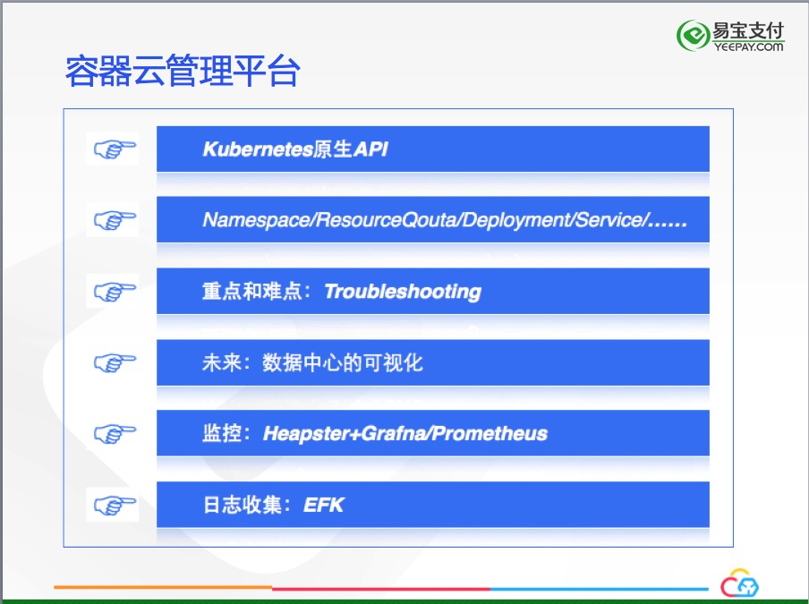

基于Kubernetes的私有容器云建设实践
====================================

非常感谢颖杰提供了这么好的分享平台。今天，很高兴为大家介绍易宝支付基于*Kubernetes*构建私有容器云的实践。

今天的分享分为如下几个部分：

### 建设背景及目标
--------------------

在*Docker*技术流行开来之前，保证软件交付的质量和速度对于大多数企业来说都是困难的。业务的复杂性造成了应用的复杂性，面对成千上万的不同应用，运维部门需要时刻应对来着不同应用、不同环境的挑战。特别是在自动化运维程度不高的企业，“人肉运维”成了解决问题的常用手段，人肉运维造成了软件交付的周期漫长，人为事故风险很高。 2013年，*Docker*横空出世，它的"Build once, Ship anywhere"的特性让软件交付焕然一新。我们是在认真调研了Docker技术后，决定构建自己的私有容器云，背景和目标如下：

实现运维自动化是我们立项之初最主要的目标，在解决运维自动化之后，后面的目标才有实现的基础。这个因素直接制约了我们的技术选型。

### 技术选型
--------------------

我们是在2015年6月份开始调研技术，2015年8月份开始容器云立项，首先要面对的问题，就是如何进行容器编排引擎的选型，当时Swarm，Mesos，Kubernetes，甚至自主研发集群编排，我们认真调研了每一种方案：

Swarm当时是0.4，当时的功能还比较简单，技术栈也简单，小团队即可驾驭，但是考虑到它不是稳定版，虽然它发展很快，但是风险比较高。

Mesos当时是0.23版本，它能够胜任大规模场景的容器编排，偏重于资源抽象，与我们大多数是Java Web的应用的场景不符，另外，Mesos技术栈与我们现有技术栈差别太大，不得不放弃这个选择。

自主研发容器编排引擎我们也考虑过，但是经过认真的探讨，自研编排引擎对标三个开源的组件的功能，研发投入需要很多的成本，可能结果并不能达到预期，投入产出比低。另外，容器云作为底层的基础设施，选择更要慎重，如果项目失败，可能会离主流的容器技术越来越远，机会成本太高，所以自研的路线也被否定。

Kubernetes是我们的最终选择，它当时已经是1.0.2版本，已经是"Production Ready"，我们选择Kubernetes的最主要的原因是它理念的先进，而且非常适合我们公司的主流应用，Java Web都是Long time running的任务，Kubernetes当时的"Replication controller"对它支持非常好。Kubernetes以应用为中心的理念和社区的活跃度更是坚定了我们的选择，历时三个月的技术选型终于落下帷幕，我们决定使用Kubernetes构建我们的私有容器云平台。

### 理论基础和原则
--------------------

在我们决定使用Kubernetes的作为容器编排引擎后，争议持续了很长的一段时间，当时国内Kubernetes的使用者非常少，很难找到成功的案例。我们需要深入的研究Docker, Kubernetes相关的容器技术，确保我们的决策是正确的，这直接关系到容器云是否能够成功。经过很多的调研和讨论，我们发现容器云的是有一套完成的理论基础支撑的，这些理论又引申出我们构建容器云的原则：

**不可变基础设施**，是利用Docker镜像的不可变性，以更加便捷的方式维护基础设施：当基础设施损坏或者变更时，以直接替换的方式达到目的，而不是通过修缮损坏的基础设施，这么做需要替换的成本足够低，Docker显然做到了这一点；对于已经运行的Docker容器，如果它出现异常，不应该再是传统ssh上去调试的方式，应该是杀掉这个容器，在启动一个新的容器；对于生产环境的运维，不可变基础设施的理念尤为重要，很多事故都是在生产环境中直接操作造成的。

**基础设施即代码**，管理基础设施像管理代码一样，每个基础设施都是“可描述”的，例如Kubernetes中的Node概念，他们也应该作为“代码”的一部分以代码的方式进行管理。

**可编程的基础设施**，基础设施不仅仅是提供计算、存储、网络资源，还要为上层应用提供可编程的接口，让上层应用可以更加灵活的使用基础设施，容器云从最开始立项就考虑到这一方面，容器云平台有一套完整的对外Restful API，可供上层应用，甚至外部应用调用。

保证构建容器云的过程能够正确的进行，还需要一些原则，”Build once，run anywhere"，一个Docker镜像要贯穿QA到生产环境的每个环节，不允许QA和生产的镜像出现不一致的情况。"ALL in one"，对于Java web应用，由于历史原因，可能多个web app运行在同一个tomcat中，要求每个docker镜像中只运行一个web app。

以应用为中心，是我们原则的中心，也是容器云构建最主要的目标，这个原则确保我们关注的重点是应用，而不是进行计算资源的抽象和资源的调度，我们的理想目标是，在“优雅地“管理应用的整个生命周期同时，顺便做好资源抽象，提高资源的利用率。

分层治理要求，基础设施的治理由容器云完成，上层应用的治理由应用治理层负责，从saas，到paas，再到caas，分层治理，各层通过接口相互调用，层与层之间互不侵入。

### 以Kubernetes为中心构建容器云
--------------------

容器云的目标决定了我们面对的是应用的管理，即应用对应的docker容器的管理，这就要求我们要以Kubernetes为中心构建容器云，而不是以docker为中心。Docker只作为应用打包、传递、运行时的工具，所有的API都要面向Kubernetes进行设计。

容器云要实现高可用的基础设施，能够支持多个数据中心。对于应用，要有多维度的高可用保证，要贯通部署流水线，通过CI/CD实现快速交付，另外，容器云的建设肩负的额外目标是要为未来2~4年的技术发展做铺垫，对于应用的CloudNative改造和整个技术团队的DevOps实践奠定基础。

容器云第一步是实现应用的全生命周期管理，让应用实现秒级的上线、回滚、升级、扩容/缩容、下线。由于历史的原因，有些应用的配置和环境耦合在一起，有的应用是对于外部依赖是硬编码（例如写死了服务方的IP地址）等，这些应用在迁移至容器云之前需要进行改造。

容器云要实现多数据中心多活，以保证数据中心级的高可用性。对于弹性扩容，我们的计划是先实现手动扩容，在实现自动扩容，对于自动扩容，先实现基于CPU/Memory的自动扩容，再实现基于Custom Metrics的自动扩容。与大多数构建容器云的方式不同，我们首先解决生产环境的运维自动化的问题，其次再解决容器的构建问题（即CI/CD)。我们的网络选型是flannel，万兆网络，flannel虽说有性能损失，远能满足我们的实际需要。存储我们使用Ceph的RBD方式，使用一年多来，RBD的方案非常稳定。Ceph FS的方式我们也有尝试，但是由于团队精力有限和可能的奉献，一直没有正式使用。

### 高可用基础设施
----------------------

容器云要实现高可用的基础设施，多维度保证应用/服务的高可用性：

在应用层面，每个应用有至少3个副本，通过Kubernetes ReplicationController/ReplicaSets来保证。强制每个应用暴露健康检查接口，通过（liveness和readness）保证应用异常后能够被及时的发现，从而用新的实例代替。

Kubernetes的组件也要实现高可用，特别是ETCD集群的高可用，定期备份ETCD的数据是个好习惯。

为了保证数据中心级别的高可用，我们在每个数据中心部署了一套Kubernetes集群，每个数据中心能够独立存活，多个数据中心互相灾备。

### 计算资源QoS与超卖
----------------------

### 容器云管理平台
----------------------

随着越来越多的应用迁移到容器云中，需要建立一个可视化的管理系统，我们使用Kubernetes原生API搭建一套Web管理系统，通过对Namespace/ResourceQuota/Deployment/Service/Endpoint等API的调用实现资源配额的划分和应用生命周期的管理。

容器云平台在易用性方面最大的挑战是Troubleshooting的环节，容器云最终是要交付开发人员使用，他们对Kubernetes并不了解，这让Troublesh的环境富有挑战，我们现在只是想通过websocket将kubectl exec的console展示给用户，没有更好的方案，如果各位有更好的方案，请不吝赐教。

容器云未来要实现整个数据中心的可视化，让运维对所有的数据中心的运行情况一目了然，当然，实现这一目标有相当的难度。

容器云的监控采用Heapster的方案，正在向Prometheus方式转变。

日志收集方式是EFK的组合

容器云管理系统的基本功能如下图所示：

日志收集方案如下图所示：

我们为Java应用提供了一个公共日志组件——appender，它会将java的日志流式输出到fluend中转，输出到fluentd中转的原因是与现有的日志中心并行运行。其他的部分跟主流的EFK模式没有任何区别。

在容器时代，CloudNative应用是必然的选择，构建云原生应用的原则请参考[12因子](https://12factor.net/zh_cn/)。

容器云管理系统也是个CloudNative应用，它也运行在Kubernetes中，与传统的上线工具不同的是，它能够进行自我生命周期管理。

Container based, Mircoservices Oriented是CloudNative倡导，只有应用向CloudNative转化，才能更好的发挥容器云的效力。

### CI/CD建设
------------------

